<!DOCTYPE html>
<html lang="en">

<head>
    <meta http-equiv="Content-Type" content="text/html; charset=UTF-8">

    <meta http-equiv="X-UA-Compatible" content="IE=edge">
    <meta name="viewport" content="width=device-width, initial-scale=1, shrink-to-fit=no">
    <!-- The above 3 meta tags *must* come first in the head; any other head content must come *after* these tags -->
    <meta name="author" content="Quan LI">
    <link rel="icon" href="./HKUST_files/favicon.ico">
    <title>Quan Li's homepage</title>

    <!-- Bootstrap core CSS -->
    <link href="./HKUST_files/bootstrap.min.css" rel="stylesheet">
    <!-- Font Open Sans -->
    <link href="./HKUST_files/css" rel="stylesheet">
    <link href="./HKUST_files/css(1)" rel="stylesheet">
    <link href="./HKUST_files/font-awesome.min.css" rel="stylesheet">
    <!-- Custom styles for this template -->
    <link href="./HKUST_files/main.css" rel="stylesheet">

    <link href="./HKUST_files/ie10-viewport-bug-workaround.css" rel="stylesheet">

    
    
    

    
</head>

<body data-gr-c-s-loaded="true">
    <noscript>
        <iframe src="https://www.googletagmanager.com/ns.html?id=GTM-N5NLLW9" height="0" width="0" style="display:none;visibility:hidden"></iframe>
    </noscript>

    

    

        

            

                

                    
                

Quan Li∙李权

                

                        Ph.D. (
                        <small>Aug. 2015 - Dec. 2018</small>)

                        [VisLab](http://vis.cse.ust.hk/) - [SNG](./SNGVis/index.html)

                        [Department of Computer Science and Engineering](https://www.cse.ust.hk/)

                        [The Hong Kong University of Science and Technology](http://www.ust.hk/)

                         Unit A, Block 7, No.1819 Shahexi Road, Shenzhenwan Science and
Technology Ecological Garden, Nanshan District, Shenzhen

                         qliba
                        _
                            <small>
                                **at**
                            </small>
                        _ connect
                        _
                            <small>
                                **dot**
                            </small>
                        _ ust
                        _
                            <small>
                                **dot**
                            </small>
                        _ hk

                         forrestli
                        _
                            <small>
                                **at**
                            </small>
                        _ webank
                        _
                            <small>
                                **dot**
                            </small>
                        _ com

                

* * *

                

                    

                        
                    

                    

                        
                    

                

            

            

                

                        
I am a Research Scientist at [WeBank AI Group](https://www.webank.com/en/). I received my Ph.D at the Hong Kong University of Science and Technology
                            [Computer Science and Engineering](https://www.cse.ust.hk/), where my supervisors are Prof.
                            [Xiaojuan Ma](http://www.cse.ust.hk/~mxj/) and Prof.
                            [Huamin Qu](http://www.huamin.org/).

Before joining HKUST, I was working in
                            [Online Game Department](http://game.163.com/),
                            [NetEase](http://www.163.com/), one of the largest internet technology companies in China. I obtained my master
                            degree from
                            [Tsinghua University](http://www.tsinghua.edu.cn/), supervised by Prof.
                            [Li Chen](http://www.tsinghua.edu.cn/publish/soften/3131/2010/20101219172834480983986/20101219172834480983986_.html), and bachelor degree from
                            [Wuhan University](http://www.whu.edu.cn/), and got another bachelor degree in English Literature from School of Foreign
                            Language at
                            [Huazhong University of Science and Technology](http://www.hust.edu.cn/).

My main research interests are in visualization, visual analytics, explainable machine learning, and human-computer interaction, with applications on 
                        FinTech, Banking, Intelligent Supply Chain, Advertisement, Block-chain, etc.

                    

* * *

#### Work/Internship Experience

                    

                        

                            Dec. 2018 - Present
                        

                        

                                Research Scientist,
                                AI Group

                                WeBank, Shenzhen, Guangdong, China

                        

                        

                            
                        

                    

                    

                        

                            Aug. 2018 - Dec. 2018
                        

                        

                                Visiting Researcher,
                                [Polo Club of Data Science](https://poloclub.github.io/)

                                School of Computational Science and Engineering, Georgia Tech, Atlanta, GA, U.S

                        

                        

                            
                        

                    

                    

                        

                            June. 2018 - Dec. 2018
                        

                        

                                Research Internship,
                                AI Group

                                WeBank, Shenzhen, Guangdong, China

                        

                        

                            
                        

                    

                    

                        

                            June. 2016 - Dec. 2018
                        

                        

                                Research Internship,
                                Department of Technology Architecture

                                WeChat, Tencent, Shenzhen, Guangdong, China

                        

                        

                            
                        

                    

                    

                        

                            June. 2016 - Dec. 2018
                        

                        

                                Key Member,
                                WeChat-HKUST Joint Lab on Artificial Intelligence Technology (WHAT Lab)

                                The Hong Kong University of Science and Technology, Hong Kong

                        

                        

                            
                        

                    

                    

                        

                            Aug. 2016 - Sep. 2017
                        

                        

                                Teaching Assistant Coordinator,
                                Department of Computer Science and Engineering

                                The Hong Kong University of Science and Technology, Hong Kong

                        

                        

                            
                        

                    

                    

                        

                            July. 2012 - July. 2015
                        

                        

                                Senior Researcher,
                                Online Game Division

                                NetEase Game, Inc. Guangzhou & Hangzhou, China

                        

                        

                            
                        

                    

                    

                        

                            July. 2011 - Sep. 2011
                        

                        

                                Software Developer Internship,
                                Department of Information & System

                                Sina Weibo, Sina Inc., Beijing, China

                        

                        

                            
                        

                    

                    

                        

                            Sep. 2007 - Aug. 2008
                        

                        

                                Teaching Assistant,
                                International School of Software

                                Wuhan University

                        

                        

                            
                        

                    

* * *

#### Publications

                    

                        

                            
                        

                        

                            

                                [ Co-design of an Interactive Analytics System for Multiplayer Online Battle Arena Game Occurrences.](http://www.autoteles.org/gdabook/)
                            

                            

                                    **<u>Quan LI</u>**, Ziming WU, Huamin QU, and Xiaojuan MA.
                            

                            

                                Wallner, G. (Ed.) Data Analytics Applications in Gaming and Entertainment. (In press)
                            

                        

                    

                    

                        

                            
                        

                        

                            

                                [ EmoCo: Visual Analysis of Emotion Coherence in Presentation Videos.](http://ieeevis.org/year/2018/info/papers)
                            

                            

                                    Haipeng Zeng, Xingbo WANG, Aoyu Wu, Yong Wang, **<u>Quan Li</u>**, Alex Endert & Huamin Qu. 
                            

                            

                                Proceedings of [IEEE VIS 2019 (VAST 2019)](http://ieeevis.org/year/2018/welcome) (to appear), Vancouver, Canada, Oct 20-25, 2019.
                            

                        

                    

                    

                        

                            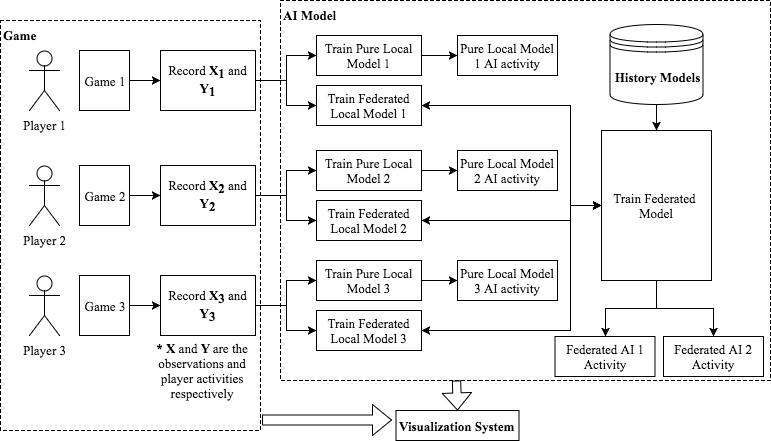
                        

                        

                            

                                [ Multi-Agent Visualization for Explaining Federated AI. ](https://www.ijcai19.org/demos.html)
                            

                            

                                Xiguang Wei, **<u>Quan Li</u>**, Yang Liu, Han Yu, Tianjian Chen, and Qiang Yang
                            

                            

                                In Proceedings of the 28th International Joint Conference on Artificial Intelligence (IJCAI) (To appear). August 10-16 2019, Macao, China.
                            

                                <!-- <small>
                                    [
                                    [Preprint](https://ieeexplore.ieee.org/document/8451903/) ]
                                </small> -->

                        

                    

                    

                        

                            
                        

                        

                            

                                [ Visualizing Event Sequence Game Data to Understand Player’s Skill Growth Through Behavior Complexity. ](https://link.springer.com/content/pdf/10.1007%2Fs12650-019-00566-5.pdf)
                            

                            

                                Wei Li, Mathias Funk, **<u>Quan Li</u>**, and Aarnout Brombacher
                            

                            

                                In Proceedings of Journal of Visualization (2019). https://doi.org/10.1007/s12650-019-00566-5.
                            

                                <!-- <small>
                                    [
                                    [Preprint](https://ieeexplore.ieee.org/document/8451903/) ]
                                </small> -->

                        

                    

                    

                        

                            
                        

                        

                            

                                [ Understanding and Modeling User-Perceived Brand Personality from Mobile Application UIs. ]()
                            

                            

                                Ziming Wu, Taewook Kim, **
                                    <u>Quan Li</u>**, and Xiaojuan Ma.
                            

                            

                                In Proceedings of the 2019 CHI Conference on Human Factors in Computing Systems (CHI '19).
                            

                                <!-- <small>
                                    [
                                    [Preprint](https://ieeexplore.ieee.org/document/8451903/) ]
                                </small> -->

                        

                    

                    

                        

                            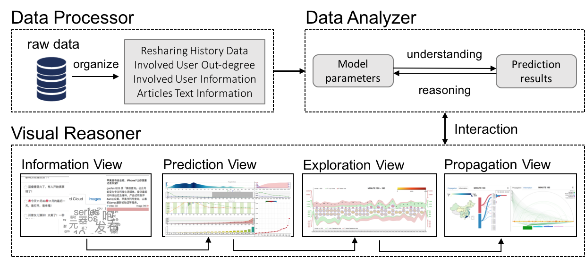
                        

                        

                            

                                [ WeSeer: Visual Analysis for Better Information Cascade Prediction of WeChat Articles. ](https://ieeexplore.ieee.org/document/8451903/)
                            

                            

                                **
                                    <u>Quan Li</u>**, Ziming Wu, Lingling Yi, Kristanto Sean N, Huamin Qu, and Xiaojuan Ma.
                            

                            

                                IEEE Transactions on Visualization and Computer Graphics (TVCG), 10.1109/TVCG.2018.2867776.
                            

                                <small>
                                    [
                                    [Preprint](https://ieeexplore.ieee.org/document/8451903/) ]
                                </small>

                        

                    

                    

                        

                            
                        

                        

                            

                                [ EmbeddingVis: A Visual Analytics Approach to Comparative Network Embedding Inspection.](http://ieeevis.org/year/2018/info/papers)
                            

                            

                                **
                                    <u>Quan Li</u>**, Kristanto Sean N, Hammad Haleem, Qiaoan Chen, Chris Yi, and Xiaojuan Ma.
                            

                            

                                Proceedings of [IEEE VIS 2018 (VAST 2018)](http://ieeevis.org/year/2018/welcome) (to appear), Berlin, Germany, Oct 21-26, 2018.
                            

                                <small>
                                    [
                                    [Preprint](https://arxiv.org/abs/1808.09074) ]
                                    [
                                    [About XAI-VIS@HKUST](http://vis.cse.ust.hk/groups/xai-vis/)
                                    ]
                                </small>

                        

                    

                    

                        

                            
                        

                        

                            

                                [ A Multi-Phased Co-design of an Interactive Analytics System for MOBA Game Occurrences.](https://dl.acm.org/citation.cfm?id=3196771)
                            

                            

                                **
                                    <u>Quan Li</u>**, Ziming Wu, Peng Xu, Huamin Qu, and Xiaojuan Ma.
                            

                            

                                Proceedings of the ACM SIGCHI Conference on Designing Interactive Systems ([DIS 2018](http://dis2018.org/)), Hong Kong, June 9-13, 2018.
                            

                                <small>
                                    [
                                    [Project Page](http://home.cse.ust.hk/~qliba/DIS_paper.htm) ]
                                </small>

                        

                    

                    

                        

                            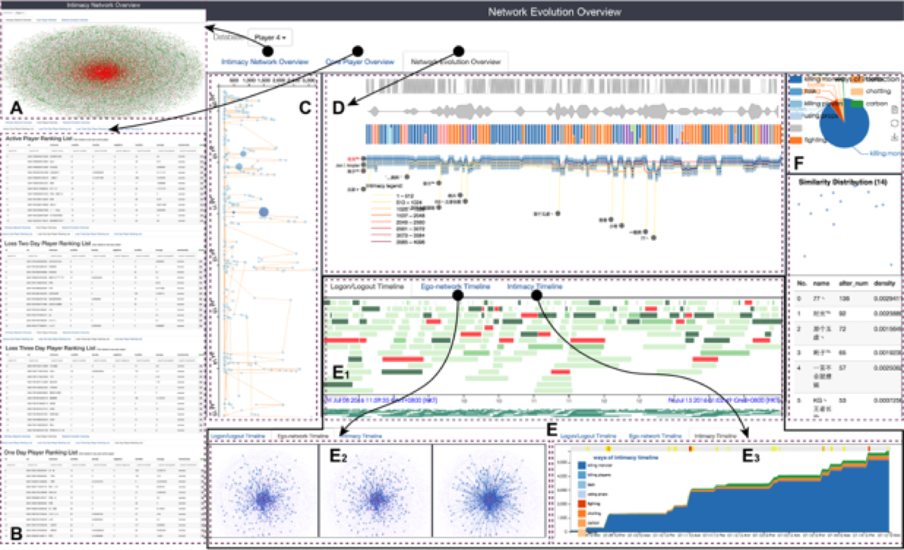
                        

                        

                            

                                [A Visual Analytics Approach for Understanding Egocentric Intimacy Network Evolution and Impact
                                    Propagation in MMORPGs.](http://home.cse.ust.hk/~qliba/pacificvis_paper.htm)
                            

                            

                                **
                                    <u>Quan Li</u>**, Qiaomu Shen, Yao Ming, Peng Xu, Yun Wang, Xiaojuan Ma, and Huamin Qu.
                            

                            

                                Proceedings of IEEE Pacific Visualization Symposium ([PacificVis 2017](http://pacificvis.snu.ac.kr/)), Seoul, South Korea, April 18-21, 2017.

                            

                                <small>
                                    [
                                    [Project Page](http://home.cse.ust.hk/~qliba/pacificvis_paper.htm) ]
                                </small>

                        

                    

                    

                        

                            
                        

                        

                            

                                [A Visual Analytics Approach for Understanding Reasons behind Snowballing and Comeback in
                                    MOBA Games.](http://ieeexplore.ieee.org/document/7534855/)
                            

                            

                                **
                                    <u>Quan Li</u>**, Peng Xu, Yeuk Yin Chan, Yun Wang, Zhipeng Wang, Huamin Qu, and Xiaojuan Ma.
                            

                            

                                IEEE Transactions on Visualization and Computer Graphics (TVCG) , vol.PP, no.99, pp.1-1, doi: 10.1109/TVCG.2016.2598415.
                            

                                <small>
                                    [
                                    [Project Page](http://home.cse.ust.hk/~qliba/tvcg_paper.htm) ]
                                </small>

                        

                    

                    

                        

                            
                        

                        

                            

                                [Animated Narrative Visualization for Video Clickstream Data](http://dl.acm.org/citation.cfm?id=3002155)
                            

                            

                                Yun Wang, Zhutian Chen,
                                **<u>Quan Li</u>**, Xiaojuan Ma, Qiong Luo, and Huamin Qu.
                            

                            

                                Proceeding of SIGGRAPH ASIA 2016 Symposium on Visualization, Article No. 11, Macau, December 05-08, 2016.
                            

                        

                    

                    

                        

                            
                        

                        

                            

                                [FPSSeer: Visual Analysis of Game Frame Rate Data](http://ieeexplore.ieee.org/stamp/stamp.jsp?tp=&amp;arnumber=7347633).
                            

                            

                                **
                                    <u>Quan Li</u>**, Peng Xu, and Huamin Qu.
                            

                            

                                IEEE Visual Analytics Science and Technology (VAST), 2015, Chicago, USA, Oct 25-30, 2015.
                            

                                <small>
                                    [
                                    [Project Page](http://home.cse.ust.hk/~qliba/vast15_paper.htm) ]
                                </small>

                        

                    

                    

                        

                            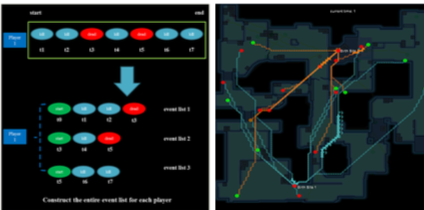
                        

                        

                            

                                [Visual Analysis of FPS Gameplay Data: From Game Design to Player Behavior](http://diglib.eg.org/handle/10.2312/pgs.20141263.119-124)
                            

                            

                                **
                                    <u>Quan Li</u>**, and Huamin Qu.
                            

                            

                                the 22nd Pacific Conference on Computer Graphics and Applications (Pacific Graphics 2014), Seoul, South Korea, Oct 8-10,
                                2014.
                            

                            <!-- 

                                <small>
                                    [
                                    [Project Page](http://home.cse.ust.hk/~qliba/tvcg_paper.htm)]
                                </small>

 -->
                        

                    

                    

                        

                            
                        

                        

                            

                                Visual Analysis of FPS Gameplay Data: From Game Design to Bug Fixes.
                            

                            

                                **
                                    <u>Quan Li</u>**, and Huamin Qu.
                            

                            

                                Proceedings of IEEE Pacific Visualization Symposium (PacificVis 2014), pages 330-334, Yokohama, Japan, Mar. 4-7, 2014.
                            

                            <!-- 

                                <small>
                                    [
                                    [Project Page](http://home.cse.ust.hk/~qliba/tvcg_paper.htm)]
                                </small>

 -->
                        

                    

                    

                        

                            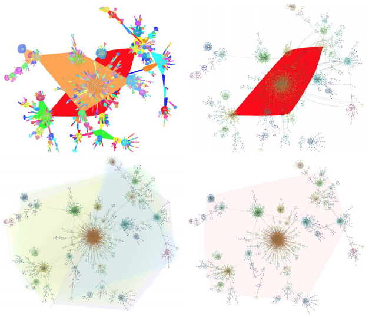
                        

                        

                            

                                [Visual Analysis of Retweeting Propagation Network in a Microblogging Platform.](http://dl.acm.org/ft_gateway.cfm?id=2493108&amp;ftid=1387016&amp;dwn=1&amp;CFID=788490792&amp;CFTOKEN=52076196)
                            

                            

                                **
                                    <u>Quan Li</u>**, Li Chen, Junhai Yong, Huamin Qu, Robert Wang, and Detan Si.
                            

                            

                                Proceedings of the 6th International Symposium on Visual Information Communication and Interaction (VINCI'13), Pages 44-53.
                            

                                <small>
                                    [
                                    [Project Page](http://home.cse.ust.hk/~qliba/vinci13_paper.htm) ]
                                </small>

                        

                    

                    

                        

                            
                        

                        

                            

                                [PatternTrack: A Visual Pattern Detection Technique for Multidimensional Data](http://ieeexplore.ieee.org/stamp/stamp.jsp?tp=&amp;arnumber=6394581).
                            

                            

                                **
                                    <u>Quan Li</u>**, Li Chen, Hongsen Liao, and Junhai Yong.
                            

                            

                                Proceedings of the 2012 International Conference on Computer Science and Service System (CSSS'12), Pages 1360-1365.
                            

                            <!-- 

                                <small>
                                    [
                                    [Project Page](http://home.cse.ust.hk/~qliba/vinci13_paper.htm)]
                                </small>

 -->
                        

                    

                    

                        

                            
                        

                        

                            

                                [MPVR: A Multi-Perspective Visual Retrieval Toolkit for Multi-dimensional Data](http://delivery.acm.org/10.1145/2540000/2534356/p265-peng.pdf?ip=175.159.121.211&amp;id=2534356&amp;acc=ACTIVE%20SERVICE&amp;key=CDD1E79C27AC4E65%2EFC30B8D6EF32B758%2E4D4702B0C3E38B35%2E4D4702B0C3E38B35&amp;CFID=788490792&amp;CFTOKEN=52076196&amp;__acm__=1463845996_fa9c95845c89adfea6f34f9699564bc0)
                            

                            

                                Yi Peng, Li Chen,
                                **
                                    <u>Quan Li</u>**, Zhu Zhu, Jie Dong, and Junhai Yong.
                            

                            

                                International Conference on Virtual-Reality Continuum and Its Applications in Industry (VRCAI'13), Pages 265-274.
                            

                            <!-- 

                                <small>
                                    [
                                    [Project Page](http://home.cse.ust.hk/~qliba/vinci13_paper.htm)]
                                </small>

 -->
                        

                    

                    

                        

                            
                        

                        

                            

                                [An Open Framework for 3D Craniofacial Visualization System.](http://ieeexplore.ieee.org/stamp/stamp.jsp?tp=&amp;arnumber=6098265)
                            

                            

                                Zhiwei Lin,
                                **
                                    <u>Quan Li</u>**, and Li Chen.
                            

                            

                                2011 4th International Conference on Biomedical Engineering and Informatics (BMEI), (Volume: 1 Page(s): 113-117).
                            

                        

                    

* * *

#### Academic & Social Works

                    

                        

                            Journal Reviewer
                        

                        

                            

                                <li>IEEE Transactions on Visualization and Computer Graphics</li>
                            

                        

                    

                    

                        

                            Conference Reviewer
                        

                        

                            

                                <li>ACM Conference on Human Factors in Computing Systems (CHI)</li>
                            

                            

                                <li>IEEE Pacific Visualization Symposium</li>
                            

                        

                    

                    

                        

                            Entrepreneurship
                        

                        

                            

                                <li>Chief Technical Director,
                                    [Pingic Factory](http://www.pingicfactory.com/about.html): A startup focusing on new media images, 3D videomapping, hologram,
                                    interactive devices, data visualization, etc.</li>
                            

                            

                                <li>
                                    [THEMOONLIGHTBOX](https://mp.weixin.qq.com/s?__biz=MzI2NDQ0MTIxMQ==&amp;mid=2247484323&amp;idx=2&amp;sn=0eb7341d602383178014539318ecbedb&amp;chksm=eaaddfb7ddda56a1783c36938e6a3eb1a3887b368aa0c8ebe540579d8a32a2cc1009f26653f0&amp;mpshare=1&amp;scene=1&amp;srcid=1015rE6Xgfx1Jvb8x7AQGicR&amp;key=ca96bbc32d023c684d5b26f09a6541b1e83523703c04ed8adb27067ec3a75f3a759db11f06b7eb6835ff356be8983ef83e3dc29606cb9e4833a10fc10215639f8a4f217854bd18215175f63e0492ab33&amp;ascene=0&amp;uin=NDU5NzM4NTU1&amp;devicetype=iMac+MacBookPro11%2C5+OSX+OSX+10.12+build(16A323)&amp;version=12010310&amp;nettype=WIFI&amp;fontScale=100&amp;pass_ticket=zEBr10nYumxGox5lNxzg3yHIQVwrAssgARlEGwkRPnlcQcL5TPAniDD6PC9PyjzR), Leader, Design Thinking, A HKUST joint course in collaboration with
                                    the China Academy of Art (CAA), one of the most influential academies of fine arts in
                                    China.
                                </li>
                            

                        

                    

                    

                        

                            Extracurricular Activities
                        

                        

                            

                                <li>Minister of the Department of Publicity at the School of Software, Tsinghua University</li>
                            

                            

                                <li>Tsinghua University Captain of Centennial English Commentary Team of Tsinghua University</li>
                            

                            

                                <li>Team member of Xi'an Social Practice in High-Technology Business and Xiamen Social Practice
                                    in Software Business</li>
                            

                            

                                <li>Student Journalist of Wuhan University Newspaper</li>
                            

                            

                                <li>Minister of the Department of Publicity at the International School of Software, Wuhan University</li>
                            

                        

                    

                

* * *

#### Talks and Presentations

                

                    

                        1 June. 2018
                    

                    

                            Invited speaker by
                                [Prof. Qiang Yang,](http://www.cs.ust.hk/~qyang/)
                            
                            AI Group

                            WeBank, Shenzhen, Guangdong, China

                    

                    

                        
                    

                

                

                    

                        19 June. 2017
                    

                    

                            "Visualization of Information Diffusion and Prediction in WeChat Platform",
                            Invited speaker for
                                [ Social Influence in Networks](http://socialinfluence.qq.com/), Satellite Symposium of
                                [NetSci 2017](http://netsci2017.net/)
                            

                            Indianapolis, Indiana, USA

                    

                    

                        
                    

                

                

                    

                        Apr. 2017
                    

                    

                            "Visual Analytics on Online Communities",
                            Invited speaker for NO.11, TALK8, Tencent Academy

                            Tencent, Shenzhen, Guangdong, China

                    

                    

                        
                    

                

                

                    

                        Oct. 2014
                    

                    

                            Invited speaker for the 2nd Alibaba's Open Data Day Seminar,
                            Alibaba

                            Hangzhou, Zhejiang, China

                    

                    

                        
                    

                

                

                    

                        2014 - 2015
                    

                    

                            Instructor of online practical course on data visualization,
                            Data Union

                            Hangzhou, Zhejiang, China

                    

                    

                        
                    

                

                

                    

                        July. 2014
                    

                    

                            Invited speaker for the visualization seminar,
                            Zhejiang University

                            Hangzhou, Zhejiang, China

                    

                    

                        
                    

                

* * *

#### Awards & Scholarship

                

                    

                        2017 - 2018
                    

                    

                            SENG Top RPG Award,
                            
                            Department of Computer Science and Engineering

                            The Hong Kong University of Science and Technology, Hong Kong

                    

                

                

                    

                        2015 - 2016
                    

                    

                            SENG PhD Fellowship,
                            
                            Department of Computer Science and Engineering

                            The Hong Kong University of Science and Technology, Hong Kong

                    

                

                

                    

                        2016 - 2017, 2017 - 2018
                    

                    

                            WeChat Scholarship,
                            
                            WeChat-HKUST Joint Lab on Artificial Intelligence Technology

                            The Hong Kong University of Science and Technology, Hong Kong

                    

                

                

                    

                        2005 - 2006, 2006 - 2007
                    

                    

                            National Scholarship,
                            
                            Minister of Education

                            Wuhan University, Wuhan, Hubei Province, China

                    

                

                

                    

                        2005 - 2006, 2006 - 2007
                    

                    

                            Outstanding Graduates of Colleges and Universities in Beijing, Outstanding Master Thesis of Tsinghua
                                University, Outstanding Graduates,
                            
                            Tsinghua University

                            Beijing, China

                    

                

                

                    

                        2009
                    

                    

                            Outstanding Graduates, Outstanding Bachelor Thesis of Wuhan University, Outstanding Bachelor
                                Thesis of Hubei Province
                            
                            Wuhan University

                            Wuhan, Hubei Province, China

                    

                

                

                    

                        2008
                    

                    

                            China Hewlett-Packard (HP) Outstanding Student Scholarship
                            
                            Wuhan University

                            Wuhan, Hubei Province, China

                    

                

                

                    

                        2010 - 2011
                    

                    

                            1st Prize on Essay Competition,
                            
                            Embassy of Ireland

                            Beijing, China

                    

                

                

                    

                        2010 - 2011
                    

                    

                            1st Class Scholarship of Tsinghua Research in Motion Wireless Research,
                            
                            Tsinghua University

                            Beijing, China

                    

                

                

                    

                        2009 - 2010
                    

                    

                            2nd Tsinghua University Graduate Scholarship,
                            
                            Tsinghua University

                            Beijing, China

                    

                

                

                    

                        2010 - 2011
                    

                    

                            Outstanding Graduates Party Branch Secretary,
                            
                            Tsinghua University

                            Beijing, China

                    

                

                

                    

                        2005 - 2006, 2006 - 2007, 2007 - 2008
                    

                    

                            Excellent Student for three times, 1st Class Student Scholarship for three times,
                            
                            Wuhan University

                            Wuhan, Hubei Province, China

                    

                

                

                    

                        2005 - 2006
                    

                    

                            Huang ZhangRen Special Scholarship,
                            
                            Wuhan University

                            Wuhan, Hubei Province, China

                    

                

            

        

    

    <!-- /.row -->

    

        <header class="major">

#### Sketch from My Life

        </header>

        

            <table>
                <tr>
                    <td>
                        [
                            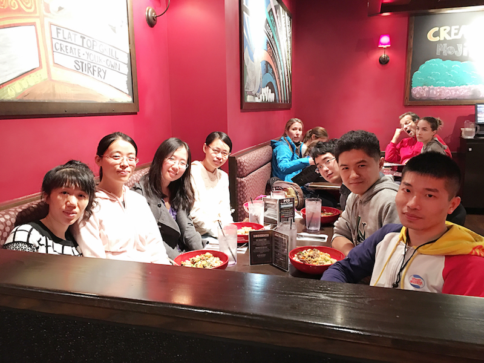
                        ](./HKUST_files/photo/1.jpg)
                        

Dinner with friend @ IEEE VIS 2015

                        

                    </td>
                    <td>
                        [
                            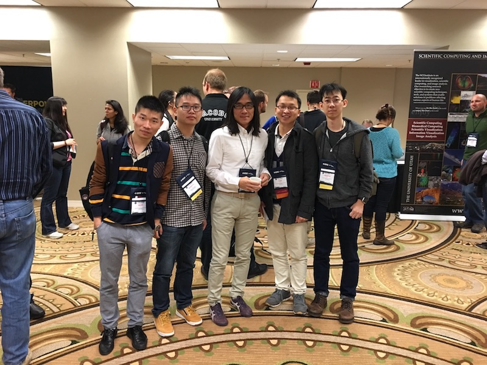
                        ](./HKUST_files/photo/2.jpg)
                        

Lab mates with Prof. Kwan-Liu Ma

                        

                    </td>
                    <td>
                        [
                            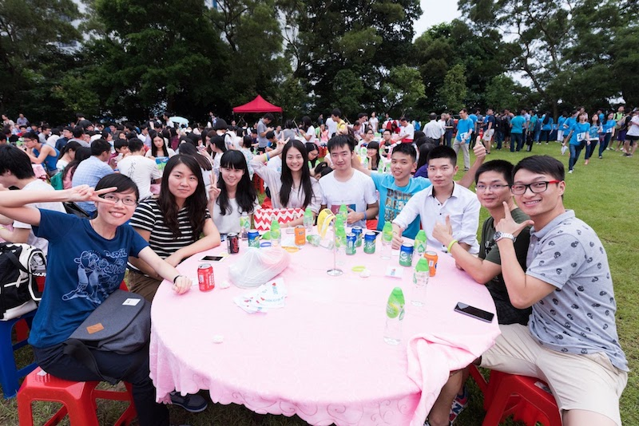
                        ](./HKUST_files/photo/3.jpg)
                        

The first dinner at HKUST

                        

                    </td>
                    <td>
                        [
                            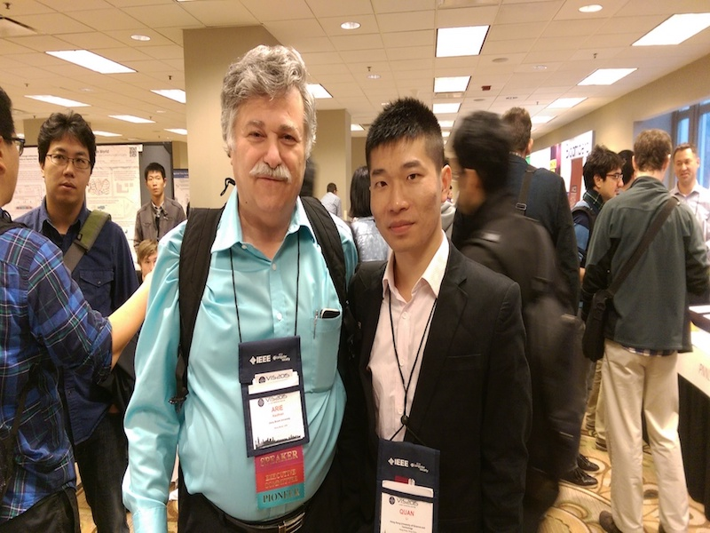
                        ](./HKUST_files/photo/4.jpg)
                        

Photo with Prof. Arie Kaufman

                        

                    </td>
                </tr>

                <tr>
                    <td>
                        [
                            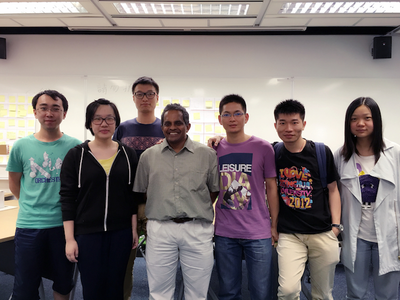
                        ](./HKUST_files/photo/5.jpg)
                        

Photo at design thinking course

                        

                    </td>
                    <td>
                        [
                            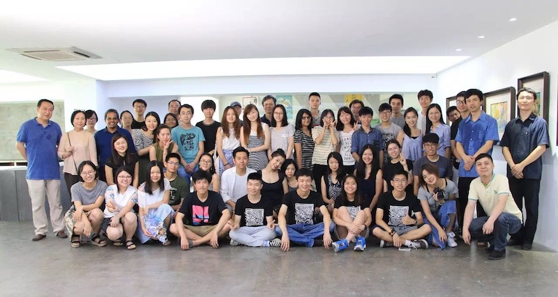
                        ](./HKUST_files/photo/6.jpg)
                        

All students after design thinking course

                        

                    </td>
                    <td>
                        [
                            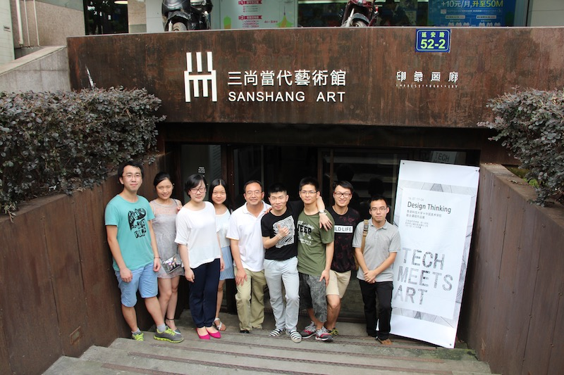
                        ](./HKUST_files/photo/7.jpg)
                        

With Prof. Qu in front of Hangzhou exhibition center

                        

                    </td>
                    <td>
                        [
                            
                        ](./HKUST_files/photo/8.jpg)
                        

After visiting elderly center in Hong Kong

                        

                    </td>
                </tr>

                <tr>
                    <td>
                        [
                            
                        ](./HKUST_files/photo/9.jpg)
                        

Meet with friend from CAA

                        

                    </td>
                    <td>
                        [
                            
                        ](./HKUST_files/photo/10.jpg)
                        

Happy birthday to me and my wife

                        

                    </td>
                    <td>
                        [
                            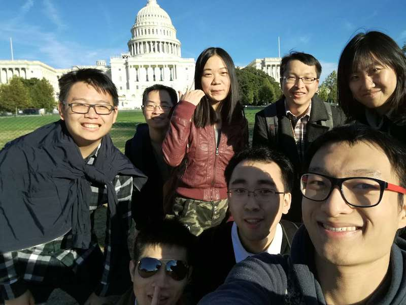
                        ](./HKUST_files/photo/11.jpg)
                        

Travel in Washington D.C. after IEEE VIS 2016

                        

                    </td>
                    <td>
                        [
                            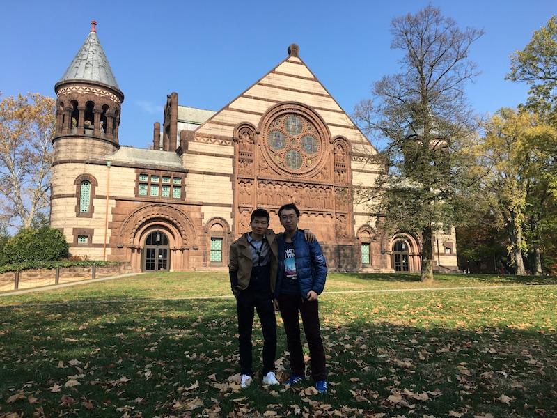
                        ](./HKUST_files/photo/12.jpg)
                        

With Qiaomu at Princeton University

                        

                    </td>
                </tr>

                <tr>
                    <td>
                        [
                            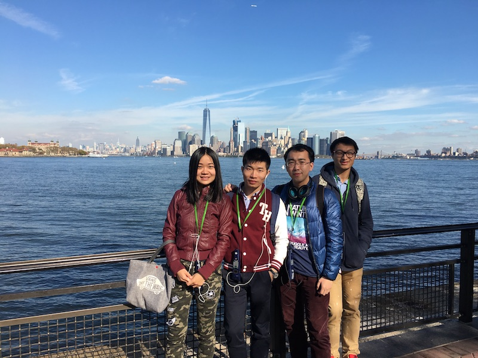
                        ](./HKUST_files/photo/13.jpg)
                        

With lab mates in New York

                        

                    </td>
                    <td>
                        [
                            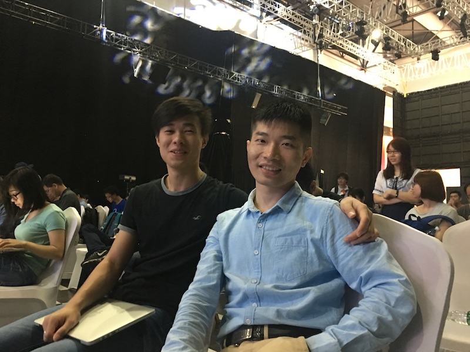
                        ](./HKUST_files/photo/14.jpg)
                        

With Mingfei at WeChat, Guangzhou

                        

                    </td>
                    <td>
                        [
                            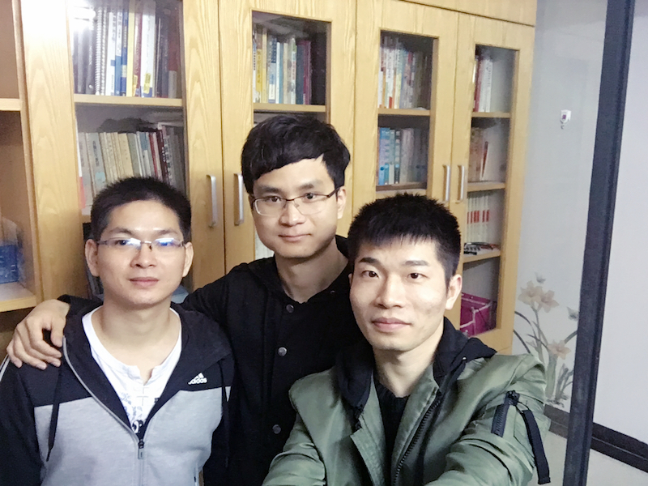
                        ](./HKUST_files/photo/15.jpg)
                        

With my best friends in Dongguang

                        

                    </td>
                    <td>
                        [
                            
                        ](./HKUST_files/photo/16.jpg)
                        

New year gathering at Prof. Qu's house

                        

                    </td>
                </tr>

                <tr>
                    <td>
                        [
                            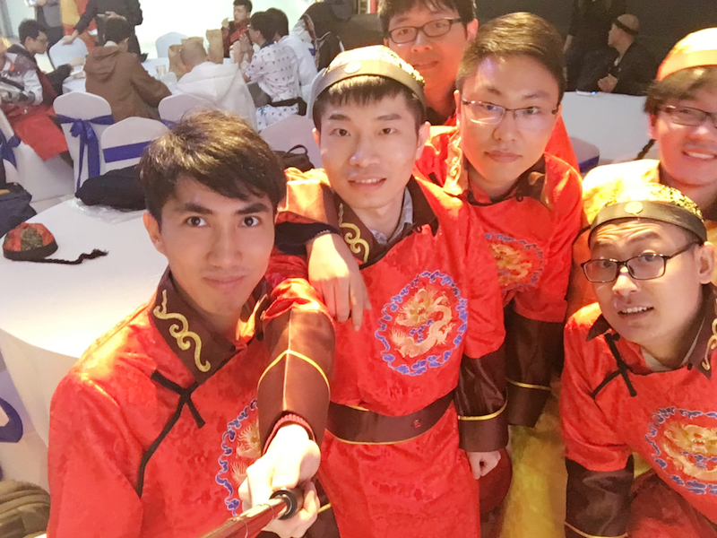
                        ](./HKUST_files/photo/17.jpg)
                        

With Tencent friends

                        

                    </td>
                    <td>
                        [
                            
                        ](./HKUST_files/photo/18.jpg)
                        

My wedding photos

                        

                    </td>
                    <td>
                        [
                            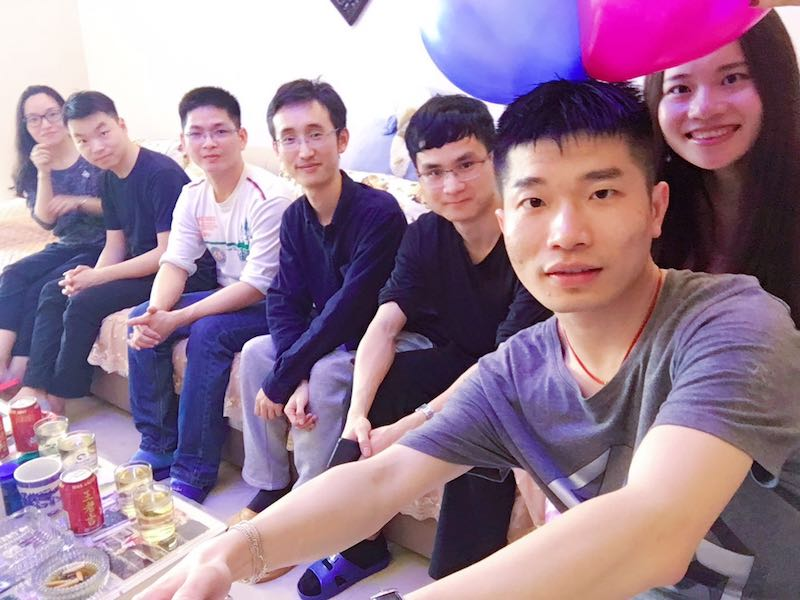
                        ](./HKUST_files/photo/19.jpg)
                        

Gathering with my groomsman before wedding

                        

                    </td>
                    <td>
                        [
                            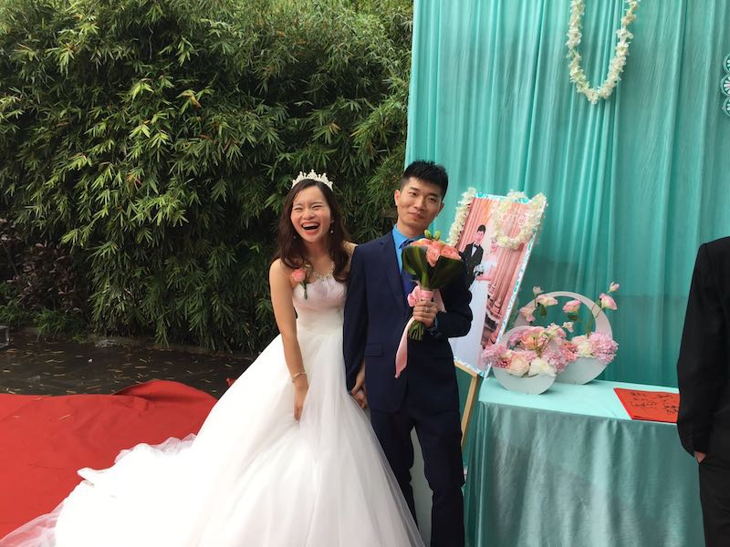
                        ](./HKUST_files/photo/20.jpg)
                        

My wedding (2017.04.09)

                        

                    </td>
                </tr>

                <tr>
                    <td>
                        [
                            
                        ](./HKUST_files/photo/21.jpg)
                        

With my groomsman at wedding

                        

                    </td>
                    <td>
                        [
                            
                        ](./HKUST_files/photo/22.jpg)
                        

HKUST big data day

                        

                    </td>
                    <td>
                        [
                            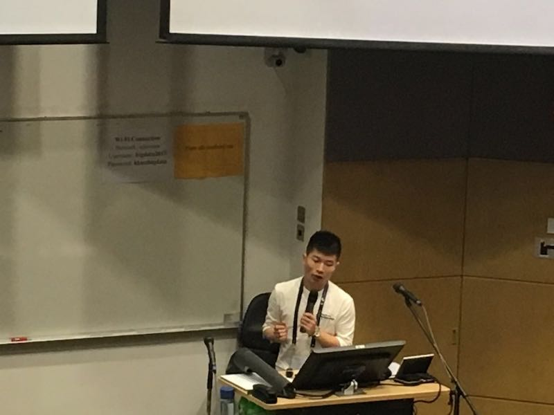
                        ](./HKUST_files/photo/23.jpg)
                        

Talk at HKUST big data day

                        

                    </td>
                    <td>
                        [
                            
                        ](./HKUST_files/photo/24.jpg)
                        

With HKUST undergraduates at THU

                        

                    </td>
                </tr>

                <tr>
                    <td>
                        [
                            
                        ](./HKUST_files/photo/25.jpg)
                        

Visit Software School at Tsinghua

                        

                    </td>
                    <td>
                        [
                            
                        ](./HKUST_files/photo/26.jpg)
                        

Dinner with HKUST undergraduate students

                        

                    </td>
                    <td>
                        [
                            
                        ](./HKUST_files/photo/27.jpg)
                        

With Tencent colleagues at NetSci

                        

                    </td>
                    <td>
                        [
                            
                        ](./HKUST_files/photo/28.jpg)
                        

With Tencent colleagues at NetSci

                        

                    </td>
                </tr>

                <tr>
                    <td>
                        [
                            
                        ](./HKUST_files/photo/29.jpg)
                        

With Tencent colleagues at San Francisco

                        

                    </td>
                    <td>
                        [
                            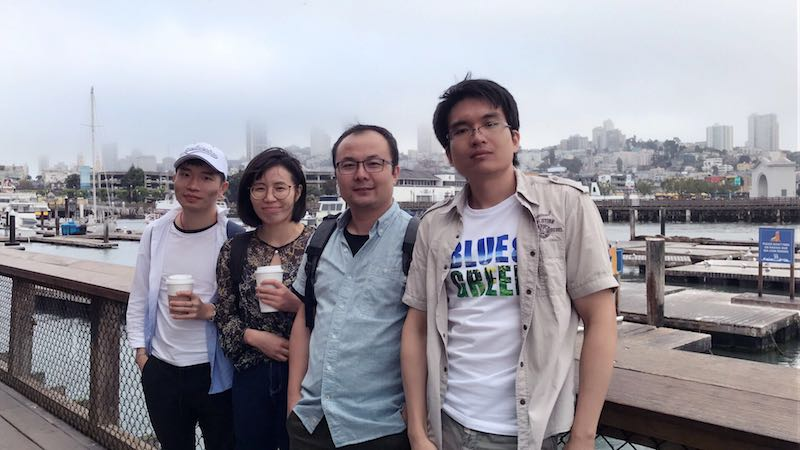
                        ](./HKUST_files/photo/30.jpg)
                        

With Tencent colleagues at San Francisco

                        

                    </td>
                    <td>
                        [
                            
                        ](./HKUST_files/photo/31.jpg)
                        

With Tencent colleagues at Tencent America

                        

                    </td>
                    <td>
                        [
                            
                        ](./HKUST_files/photo/32.jpg)
                        

Visit Facebook with Tencent colleagues

                        

                    </td>
                </tr>

            </table>

        

        <footer class="footer text-center opensans light">

* * *

            <small>Copyright © 2015 - Present
                <!-- Quan Li</small> -->

        </footer>
    

    <!-- /.container -->
    <!-- Bootstrap core JavaScript
    ================================================== -->
    <!-- Placed at the end of the document so the pages load faster -->
    
    
    
    <!-- IE10 viewport hack for Surface/desktop Windows 8 bug -->
    
    <!-- For UST website -->
    
    
    
    

    Save
    
</body>

</html>
